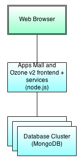

#Apps Mall and Ozone Platform Architecture Design
The Apps Mall project is comprised of several components all hosted by node.js with optional deployment strategies depending on the target environment. This document outlines the overall design of the project, how its structured and the various deployment strategies that are possible. For further API documentation please see the [README.md](../).

##Contents
* [Overview](#overview)
    * [Apps Mall and Ozone Platform Default Bundle](#overviewDefaultBundle)
    * [Apps Mall and Ozone Platform Tiered](#overviewTiered)
    * [Ozone Platform Services](#overviewOzoneServices)
* [Ozone Services Container](#ozoneServiceContainer)
    * [Configuration](#ozoneServiceContainerConfig)
    * [Distributed Session](#ozoneServiceContainerSession)
    * [Security](#ozoneServiceContainerSecurity)
    * [Technology Stack](#ozoneServiceContainerStack)
* [Apps Mall](#appsmall)
    * [Ozone Services Used](#appsmallOzoneServices)
    * [Apps Mall Service](#appsmallService)
    * [Technology Stack](#appsmallStack)
* [Ozone HUD](#ozoneHud)
    * [Technology Stack](#ozoneHudStack)
    * [SSL Considerations](#ozoneHudSslCon)
* [Ozone API](#ozoneApi)
    * [Overview](#ozoneApiOverview)
    * [ozoneApiService](#ozoneApiService)
    * [Server-Side](#ozoneApiServer)
        * [Ozone.routing](#ozoneApiServerRouting)
        * [Ozone.load](#ozoneApiServerLoad)
    * [Client-Side](#ozoneApiClient)
        * [Ozone.ajax](#ozoneApiClientAjax)
        * [Ozone Services](#ozoneApiClientServices)
    * [Technology Stack](#ozoneApiStack)
* [Ozone Modules](#ozoneModules)
    * [Bundled Modules](#ozoneModulesBundle)
    * [Ozone Persistence Service](#ozoneModulesPersistence)


##<a name="overview"></a>Overview
Apps Mall comes bundled with the Ozone Platform which is where services and security are handled. Apps Mall itself is essentially one frontend application and a small Ozone Service that hooks into the Ozone Service Container along with the support Ozone HUD frontend application. The following overviews give a high level account of what the default and tiered deployment strategies look like and what the architecture of the Ozone Platform looks like.

###<a name="overviewDefaultBundle"></a>Apps Mall and Ozone Platform Default Deployment
This is the default state the Apps Mall project is in when cloning directly from the GitHub repository. Apps Mall frontend is hosted with the Ozone HUD frontend along with Ozone v2 services all within the same node.js application.

[](assets/appsmall-overview-default.png)

###<a name="overviewTiered"></a>Apps Mall and Ozone Platform Tiered Deployment
The tiered deployment of Apps Mall and Ozone Services works by splitting the Apps Mall, Ozone HUD and Ozone Services into separate components all to be hosted on their own with configurations that point to each other where necessary. The CDN cluster is where all static content can (optionally) be stored; so JavaScript, CSS and Images can all be placed within a CDN and served through a dedicated and static server.
[](assets/appsmall-overview-production.png)

###<a name="overviewOzoneServices"></a>Ozone Platform Services
The Ozone Platform Services are where all services are hosted and is highly extensible. When a request comes into the service container it is run through the security module, its session is updated or created within the specified session provider and then the appropriate service handles the request and sends a response back to the client.

The persistence service provides a generic storage mechanism for all services to use and each service can communicate with one another via the Ozone API.
[](assets/ozone-v2-services-overview.png)

##<a name="ozoneServiceContainer"></a>Ozone Services Container
The Ozone Services Container is a single node.js application designed to dynamically load Ozone Modules in a similar fashion to node modules. The service container can optionally run any of the Ozone Services along with any of the bundles frontends (Apps Mall, App Builder or Ozone HUD).

###<a name="ozoneServiceContainerConfig"></a>Configuration
Configuration is handled in a similar way to a Ruby on Rails project; there is a default configuration located at ```config/default.js``` which has all defaults setup within a JavaScript Object and an environment file which can override anything in the default file. The environment file is specified inside of the ```package.json``` file and are located in ```config/environments/```.

###<a name="ozoneServiceContainerSession"></a>Distributed Session
Creating a highly scalable web application needs distributed session access to ensure load balancing won't interfere with a user's current work. The service container has 3 session providers; an in-memory session provider used for development or testing on single node deployments and a redis and memcached provider to distribute the session across multiple nodes.

###<a name="ozoneServiceContainerSecurity"></a>Security
Security is handled by including a security module which implements an express.js middleware to be plugged into the application's engine. The included mock security allows anyone to authenticate as whatever user they want and with whichever role they desire and should ONLY be used as a template and guide for developing a production-ready security module. It is not recommended to run the mock security service in any production capacity only in development or testing.

###<a name="ozoneServiceContainerStack"></a>Technology Stack
The service container is implemented in JavaScript and executed using node.js. Its primary engine is express.js for all RESTful communication and makes use of CommonJS to include Ozone Modules. It also uses grunt.js for many types of tasks including cleaning and building of the Ozone API.

##<a name="appsmall"></a>Apps Mall
Apps Mall is the main, frontend application which uses almost all available Ozone Services.

###<a name="appsmallOzoneServices"></a>Ozone Services Used
Apps Mall consumes most of the bundled Ozone Services which includes:
* Applications
    * Handles the storage and manipulation of application meta data along with publication status.
* Personas
    * Handles the permissions and roles used within Apps Mall
    * Handles the storage and manipulation of a user's persona data which includes their authentication information, favorite applications and recently launched applications.
* Security
    * Handles the authentication into the system.
* Tagging
    * Handles categories
    * Handles collections
    * Handles application tags
    * Handles organizations
* Import and Exporter plus Persistence by proxy (Apps Mall doesn't use these directly but the other, consumed services do).

###<a name="appsmallService"></a>Apps Mall Service
Applications are decoupled from Apps Mall itself allowing the Ozone HUD and Ozone Platform to be deployed without Apps Mall and still have access to applications. This means that the only data handled by the Apps Mall service are user reviews and ratings.

###<a name="appsmallStack"></a>Technical Stack
Apps Mall consists of a frontend written with AngularJS, unit tests that run through karma and the backend service is an Ozone Module written in JavaScript.

##<a name="ozoneHud"></a>Ozone HUD
The Ozone HUD is the main container for applications to live inside of. It provides an iframe to allow an external application to be loaded within, an overlay interface that allows access to a user’s favorite or recent applications along with the user’s profile information. The Ozone HUD is designed to be deployed as bundle of static content which is then configured to use the Ozone Services Container and its services within.

###<a name="ozoneHudStack"></a>Technology Stack
The technology stack for Ozone HUD is fairly lightweight in that it uses a flavor of W3C's Web Components (a custom implementation of x-tags essentially) and some jQuery. The HUD was designed to be highly customizable and architected for possible inclusion into another web application versus displaying it within an iframe at a later time.

###<a name="ozoneHudSslCon"></a>SSL Considerations
Since the Ozone HUD loads web applications into an iframe it is important that any websites using SSL have a valid certificate to ensure proper loading within an iframe. Using a self-signed or simply an invalid SSL certificate will result in the majority of modern browsers displaying an error within the iframe.

A workaround for development or temporary purposes for this consideration consists of opening the target web site / application in a new tab, accepting the invalid certificate and then attempting to reopen it within the Ozone HUD.

##<a name="ozoneApi"></a>Ozone API
The Ozone API is the critical glue that keeps everything within the Ozone Platform and even Apps Mall together. Designed to be light weight with very little dependencies (currently only depends on socket.io for the deprecated Ozone Messaging test) the Ozone API is the primary place all Ozone Modules on the backend and any code on the frontend should be using for interacting with the Ozone Platform.

The beauty of using JavaScript for all aspects of the Ozone Platform allows us to create a consistent Ozone API and re-use all parts where possible for the client and the server.

###<a name="ozoneApiOverview"></a>Overview
The Ozone API source is broken into 3 sections which communicate their intent fairly well; there is a client, a common and a server folder. Each folder contains code specific to the specified environment.

When the Ozone API is built using the ```grunt build``` command it generates the following files: ```client-api.js```, ```client-api.min.js``` and ```server-api.js```. The two client files are identical except the min file is minified for the browser (this is unnecessary for server-side usage).

When the Ozone API is built for the client it takes all files within the client and common file, combine them together after ```main.js``` and before ```module.exports.js```. When it's built for the server it takes a similar path; all code in the common and server folders are combined then it's put after the contents of ```main.js``` and before ```module.exports.js```. These files can then be included into the appropriate environment an are self contained.

###<a name="ozoneApiService"></a>Ozone.Service
The Ozone.Service() method is at the heart of all services on the server and client side. Ozone.Service allows a service to register itself for discovery and usage without modifying the Ozone object itself and allows for APIs to naturally be added without requiring a rebuild or change to the main Ozone API (this allows developers to extend the Ozone API without making any changes to it).

Usage is covered more indepth within the Ozone API documentation but this essentially allows service providers to register their service to be used, service consumers to discover and use services and a ready event allows for the loading and waiting of different services to become available.

###<a name="ozoneApiServer"></a>Server-Side
The server-side only has two components not available to the client: Ozone.routing and Ozone.load. These two components require, and only function, node.js to run.

####<a name="ozoneApiServerRouting"></a>Ozone.routing
The Ozone.routing object allows all of the same access express.js exposes when routing RESTful services. The main difference is that all methods run through the Ozone Security and Ozone Persona Permissions services to ensure a user is authenticated (if required) and have the correct permissions (if required). A secondary difference is that all routes generated are placed behind the configured URL for the service. For example ```/example/``` will be output, with a default configuration, as ```/api/example/```. This allows the RESTful servers to have any necessary URL without modifying any code.

Typical RESTful route with zero authentication has the same signature as an express.js application and can, in fact, be converted back and forth with a single line of code. The following is an example using no authentication and shows the differences between an express.js vanilla application and using Ozone.routing.

```
// Ozone API routing method
Ozone.Routing.get("/example/", function (req, res, next) {
    res.send(shout("Example module here"));
});

// express.js routing method
app.get("/api/example/", function (req, res, next) {
    res.send(shout("Example module here"));
});
```

Using authentication simply requires an additional parameter that specifies the required access level. The access object is very basic in that it only requires two keys: ```loggedIn``` which should be a boolean value indicating whether a user is required to be logged in to hit this service and ```permissions``` which should contain an array of required permissions in order to hit this service. The following is an example.

```
Ozone.Routing.get("/example/", { loggedIn: true, permissions: ["/Ozone/System/Administration/"] }, function (req, res, next) {
    res.send(shout("Example module here"));
});

```

The authenticated example above requires that a user be logged in and to have the system administration permission.

####<a name="ozoneApiServerLoad"></a>Ozone.load
This is a simple method designed to simply load Ozone Modules. At its very basic core it takes whatever is passed into it and calls the CommonJS ```require()``` method and passes in the Ozone API.

###<a name="ozoneApiClient"></a>Client-Side
The Ozone API client side code is essentially a wrapper around all of the exposed RESTful services. It has some utilities, an ajax method that largely mimics the jQuery method and an API for each bundled Ozone Service.

####<a name="ozoneApiClientAjax"></a>Ozone.ajax
The Ozone.ajax method closely mimics the jQuery version of the same method. So why create a new one instead of reusing the jQuery method? The Ozone API is designed to be included in any web application and while the jQuery version is simply fantastic it's extra overhead to include the entire jQuery library simply to reuse one method that's pretty well understood. There are also issues that could arise from using multiple versions of jQuery simply because we bundled a newer or older version than what the web application is including.

Thus a method with the same signature and mostly same behavior (just a few additional defaults) was created. Additional API usage information can be found in the API documentation or looking at jQuery's ajax method.

####<a name="ozoneApiClientServices"></a>Services
There is a service for almost each exposed RESTful service. The APIs for each one are located within the API documentation for each service and are fairly straight forward.

###<a name="ozoneApiStack"></a>Technology Stack
The Ozone API is largely made up of native JavaScript with only one dependency which is socket.io. Socket.io was used in a pilot of Ozone Messenger but has since been deprecated and can be removed as the API was never completed and stabilized. The Ozone API also makes use of grunt for building the main files to be included on the server or client.

##<a name="ozoneModules"></a>Ozone Modules
Ozone Modules are a way to extend the capabilities of the service container. Ozone Modules are identical to node modules except that they can accept the Ozone API as initial input *and* can be automatically started depending on the specified configuration.

###<a name="ozoneModulesBundle"></a>Bundled Modules
There are multiple modules bundled within the Ozone Platform. The following are bundled with additional API documentation linked.

* Bundled Ozone Platform Services
    * [Ozone Persistence Service](ozone-services-persistence.md)
    * [Ozone Applications Service](ozone-services-applications.md)
    * [Ozone Tagging Service](ozone-services-tagging.md)
    * [Ozone Personas Service](ozone-services-personas.md)
    * [Ozone Security Service](ozone-services-security.md)
    * [Ozone Importer and Exporter Service](ozone-services-importer-exporter.md)
    * [Ozone Messaging Service](ozone-services-messaging.md)
    * [Ozone Session Providers](ozone-session-providers.md)
    * [Ozone Status Service](ozone-services-status.md)

###<a name="ozoneModulesPersistence"></a>Ozone Persistence Service
The persistence service is a unique module in that it provides an interface for how data and file blobs should be accessed (file blobs and data can even be different implementations so, for example, data could live in MongoDB and files could live in HDFS with the same interface). This interface is fairly generic through roughly based upon the MongoDB JavaScript driver and allows for any backend to be implemented using the same interface. By default MongoDB and a mock, in-memory, data stores implement the interface and work as expected.

See the [Ozone Persistence Service](ozone-services-persistence.md) documentation for more information regarding the API and implementations.
